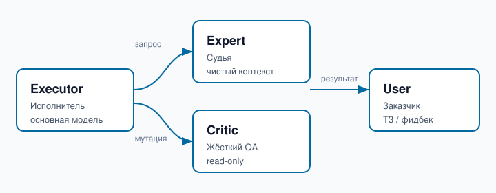

# ArchAI - Free

### Многоролевая архитектура ИИ-агента · Executor · Expert · Critic

[](LICENSE)
[](https://github.com/satyasai-collab/archai-free)
[](docs)
[](.)

> Открытая реализация жёсткого многоагентного протокола: исполнитель не принимает
> архитектурных решений сам — каждый шаг и каждая мутация проходят верификацию
> судьёй (Expert) и автоматическим критиком (Critic).

---

## Возможности

- **Трёхролевая схема** - `Executor` (основная модель), `Expert` (sudya s chistym
  kontekstom и nulem instrumentov), `Critic` (жёсткий QA, только чтение).
- **HARD STOP мутаций** - любая мутация без вердикта Critic блокируется протоколом.
- **Монитор дрейфа** - `opencode/plugin/expert_monitor.ts` со счётчиками шагов и
  TTL-разблокировкой.
- **Готовые конфиги** для [opencode](opencode/) и [Hermes](hermes/).
- **DoD-верификация** - явное определение готовности для каждого шага.

## Архитектура



Potok: `Executor` получает задачу от `User`, вызывает `Expert` для декомпозиции i
верификации, выполняет шаги, затем `Critic` жёстко проверяет результат до ответа
пользователю. Любая мутация системы требует вердикта `Expert` и `Critic`.

## Как это работает

1. **Декомпозиция** - `Expert` разбивает задачу на атомарные шаги с критериями успеха.
2. **Исполнение** - `Executor` выполняет шаг через инструменты.
3. **Верификация шага** - `Expert` подтверждает корректность и отсутствие регресса.
4. **Финал + Critic** - `Expert` финальная проверка, затем `Critic` (QA) по 4 фронтам.

## Структура репозитория

```
archai-free/
+-- docs/                     # Протоколы и аудит
|   +-- EXPERT_PROTOCOL.md
|   +-- HERMES_MULTI_ROLE_PROTOCOL.md
|   +-- AUDIT_2026-08-23.md
+-- opencode/                 # Конфиги opencode
|   +-- agent/{critic,expert}.md
|   +-- plugin/{expert_monitor.ts,expert_statusbar.tsx,memory.ts,statusbar.tsx}
|   +-- opencode.json.example
+-- hermes/                   # Конфиги Hermes
|   +-- config.example.yaml
|   +-- SOUL.md
|   +-- plugins/{critic_hy3,role_monitor}/
+-- assets/
|   +-- architecture.svg
+-- LICENSE
+-- README.md
```

## Быстрый старт

```bash
# opencode-конфиги
cp -r opencode/ ~/.config/opencode/

# Hermes-конфиги
cp -r hermes/ ~/.hermes/
```

Подробнее — в [docs/EXPERT_PROTOCOL.md](docs/EXPERT_PROTOCOL.md) i
[docs/HERMES_MULTI_ROLE_PROTOCOL.md](docs/HERMES_MULTI_ROLE_PROTOCOL.md).

## Лицензия

[MIT](LICENSE) - свободное использование, распространение и модификация.
